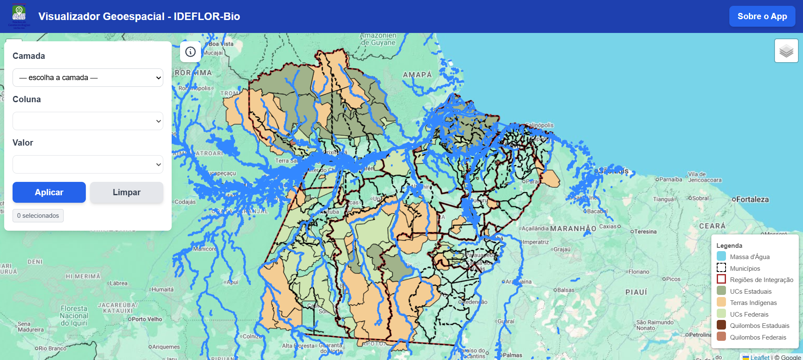
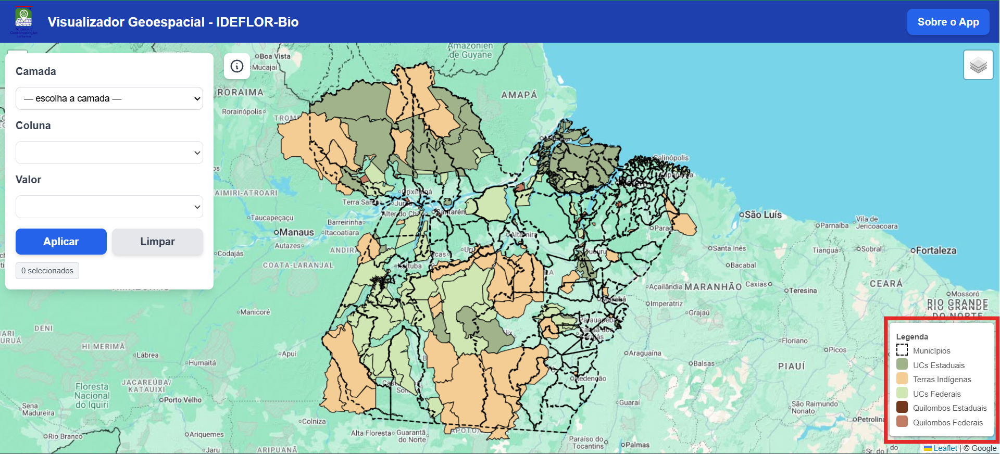
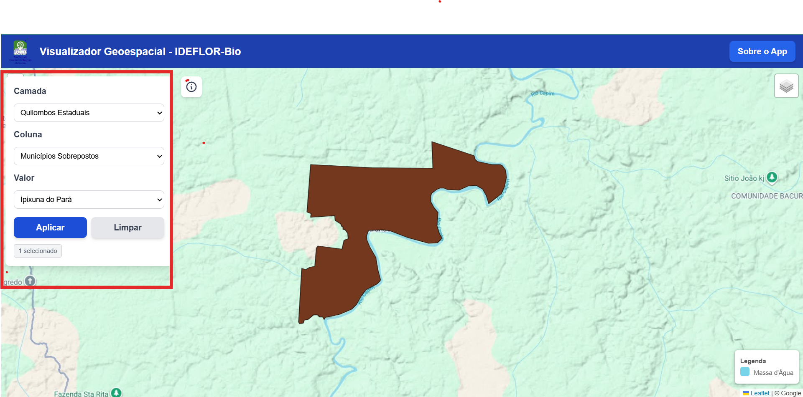
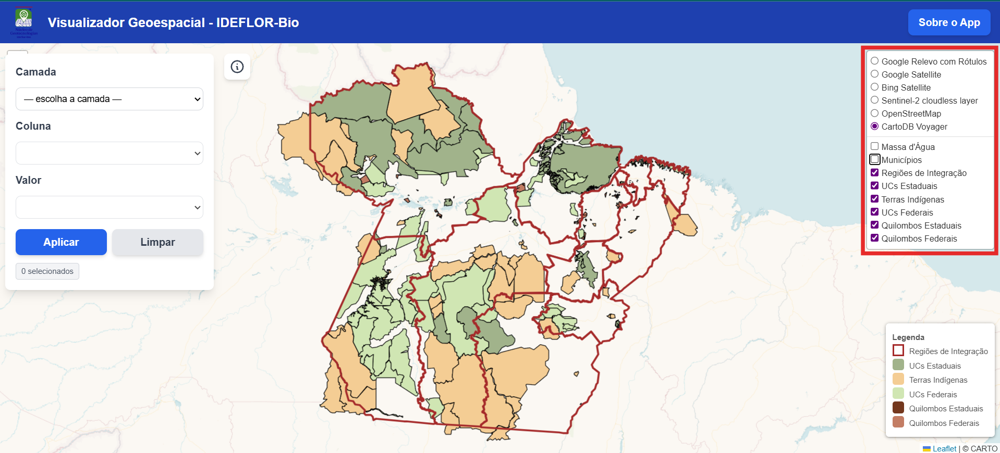
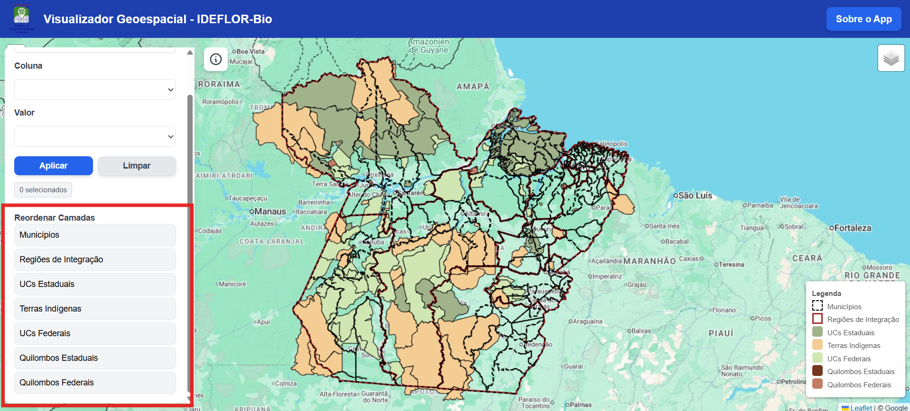

# Visualizador Geoespacial do IDEFLOR-Bio

Este é um aplicativo web interativo para visualização e análise de dados geoespaciais, desenvolvido para o Instituto de Desenvolvimento Florestal e da Biodiversidade do Estado do Pará (IDEFLOR-Bio). A ferramenta foi criada para facilitar a consulta e a exploração de diversas camadas geográficas do estado do Pará.

## Visão Geral

O projeto consiste em um mapa interativo que exibe diversas camadas de informações geográficas, como limites de municípios e regiões de integração, unidades de conservação, terras indígenas e massas d'água. Ele oferece funcionalidades de filtragem e identificação para uma análise mais detalhada dos dados.

**Screenshot da Interface Inicial:**

## Funcionalidades

### 1. Visualização de Múltiplas Camadas e Legenda

O mapa exibe várias camadas de dados geoespaciais que podem ser ativadas ou desativadas através do controle de camadas no canto superior direito. Uma legenda dinâmica no canto inferior direito mostra as cores e símbolos das camadas visíveis.

**Screenshot da Legenda:**

### 2. Filtro por Atributos

A janela de filtro no canto superior esquerdo permite que os usuários selecionem uma camada, escolham uma coluna de seus atributos e apliquem um filtro com base em um valor específico. Isso é ideal para isolar e visualizar feições com características em comum.

**Screenshot do Filtro de Camadas:**

### 3. Seletor de Camadas

É possível ativar ou desativar diferentes camadas do mapa, como municípios, regiões de integração, UCs estaduais e federais, terras indígenas e territórios quilombolas.

**Screenshot do Seletor de Camadas:**

### 4. Ferramenta de Identificação (`Identify`)

Similar a um SIG (Sistema de Informação Geográfica), a ferramenta de identificação permite ao usuário clicar em qualquer ponto do mapa para obter informações de todas as camadas visíveis naquele local.

### 5. Reordenação de Camadas

O painel de controle agora possui uma lista interativa que permite ao usuário reordenar as camadas temáticas. Basta clicar e arrastar uma camada para a posição desejada para alterar a ordem de exibição no mapa, definindo quais polígonos aparecem na frente dos outros.

**Screenshot da Reordenação de Camadas:**

---

## Tecnologias Utilizadas

- **HTML, CSS (Tailwind CSS)** e **JavaScript**: Para a estrutura e lógica da aplicação.
- **Leaflet.js**: Biblioteca de mapas de código aberto para exibir e interagir com os dados geoespaciais.
- **Leaflet.VectorGrid**: Plugin para renderizar camadas vetoriais a partir de Vector Tiles, otimizando o desempenho para grandes volumes de dados.
- **GeoJSON**: Formato de dados para as camadas de limite.
- **Vector Tiles**: Formato de dados otimizado para a camada de Massa d'Água, garantindo um carregamento rápido e uma navegação fluida em diferentes níveis de zoom.

## Como Usar

Acesse o link: [https://ngeo-ideflor-bio.github.io/visualizador/](https://ngeo-ideflor-bio.github.io/visualizador/)