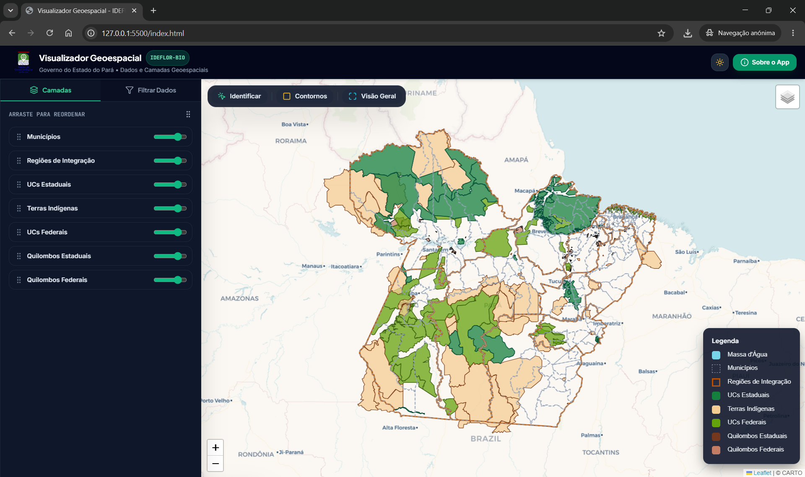
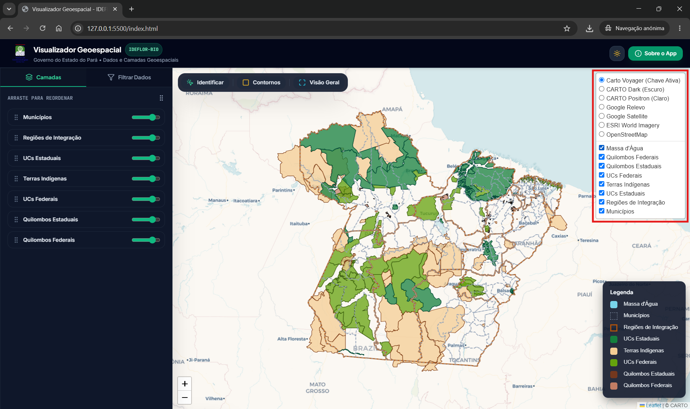
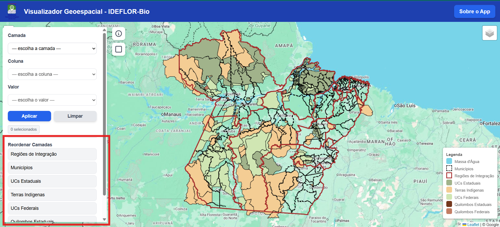
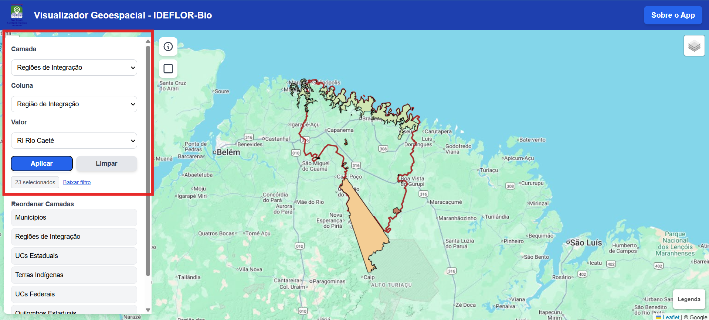
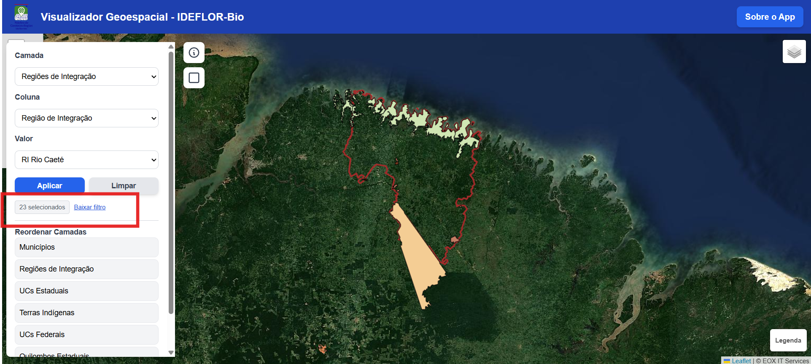
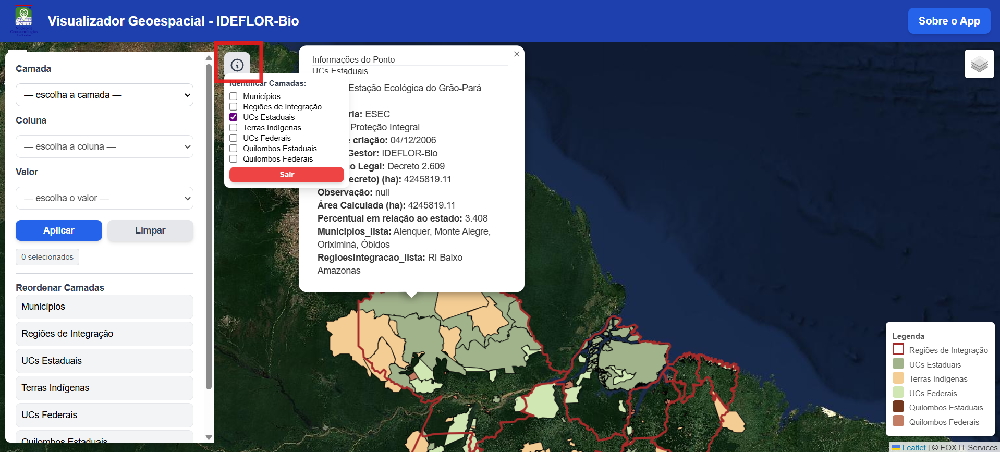
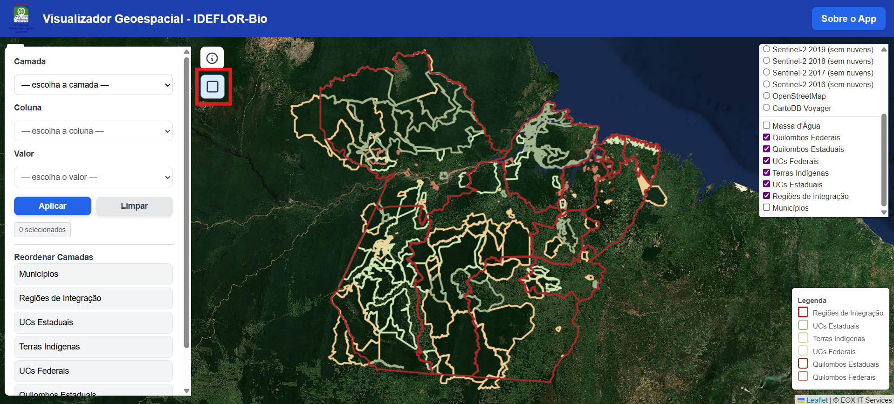
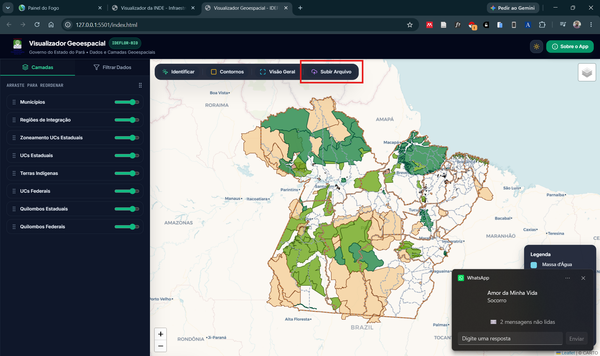
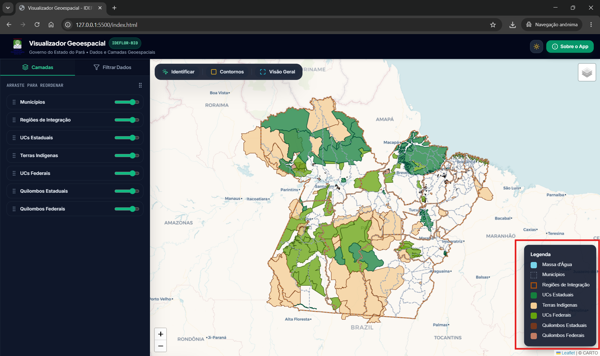

# Visualizador Geoespacial do IDEFLOR-Bio

Este é um aplicativo web interativo de **Sistema de Informação Geográfica (WebGIS)** desenvolvido para o **Instituto de Desenvolvimento Florestal e da Biodiversidade do Estado do Pará (IDEFLOR-Bio)**. A ferramenta foi projetada para otimizar a consulta, visualização e análise de dados territoriais e socioambientais do Estado do Pará em reuniões técnicas e tomada de decisão.

---

## Visão Geral

O **Visualizador Geoespacial** reúne em um único portal vetores geográficos essenciais, como limites de municípios, regiões de integração, unidades de conservação estaduais e federais, terras indígenas, territórios quilombolas e hidrografia.

A aplicação conta com uma interface moderna em **Tailwind CSS**, suporte a **Modo Escuro / Claro**, painel lateral retrátil, reordenação de camadas por *drag-and-drop*, controle individual de opacidade, ferramenta de identificação pontual com balão em ponto real, filtros por atributos com download em GeoJSON e mapas base neutros e de satélite.

**Screenshot da Interface Inicial:**

---

## Funcionalidades

### 1. Seletor de Camadas & Controle de Opacidade

Permite ativar ou desativar camadas temáticas (Municípios, Regiões de Integração, UCs Estaduais/Federais, Terras Indígenas, Quilombos e Massa d'Água) e ajustar a transparência individual de cada camada em tempo real de 0% a 100%.

**Screenshot do Seletor de Camadas:**

### 2. Reordenação Interativa de Camadas (Drag-and-Drop)

O painel de controle possui uma lista interativa baseada em *Sortable.js* que permite arrastar e soltar as camadas para definir a ordem exata de exibição no mapa (quais polígonos ficam sobrepostos à frente).

**Screenshot da Reordenação de Camadas:**

### 3. Filtro por Atributos & Download GeoJSON

Permite isolar feições selecionando a camada, coluna de atributos e valor desejado. Exibe a contagem exata de itens selecionados e permite o download imediato dos dados filtrados no formato GeoJSON. Para Municípios e Regiões de Integração, calcula também todas as UCs, Terras Indígenas e Quilombos sobrepostos.

**Screenshot do Filtro por Atributos:**

**Screenshot do Download de Dados:**

### 4. Ferramenta de Identificação (`Identify`) com Balão Ancorado

Similar aos SIGs profissionais, permite clicar em qualquer ponto do mapa para abrir um **Balão Popup ancorado** (`z-index: 99999`) trazendo a lista de atributos de todas as camadas visíveis ou filtradas naquele local. Inclui um menu de seleção de quais camadas devem ser consultadas.

**Screenshot da Ferramenta de Identificação:**

### 5. Modo Contorno (Outline)

Alterna a renderização de polígonos entre preenchimento sólido e contorno espesso vazado, ideal para analisar imagens de satélite e sobreposição de limites sem obstrução visual.

**Screenshot do Modo Contorno:**

### 6. Subir Arquivo Vetorial (Shapefile .zip, KML, GeoJSON)

Permite carregar arquivos geoespaciais locais diretamente no navegador através do botão **Subir Arquivo** na barra superior. Suporta arquivos **Shapefile (.zip)**, **KML (.kml)** e **GeoJSON (.geojson / .json)**. O processamento é realizado 100% no client-side (compatível com GitHub Pages), realizando centralização automática no mapa (*flyToBounds*) e adicionando o vetor à legenda e lista de camadas.

**Screenshot do Carregamento de Vetor:**

### 7. Zoneamento das UCs Estaduais

Inclui os zoneamentos das Unidades de Conservação Estaduais do Pará com simbologia institucional categorizada (Preservação, Conservação, Amortecimento, Uso Moderado, Uso Intensivo, Produção, Recuperação). A camada inicia **desligada por padrão** para garantir leveza na inicialização, sendo suportada no modo preenchido e contorno (Outline).

### 8. Legenda Dinâmica e Controles Responsivos

Uma legenda dinâmica no canto inferior direito exibe as cores e estilos das camadas ativas. Os botões de zoom `+` / `-` ficam situados no canto inferior esquerdo e toda a interface é 100% responsiva para dispositivos móveis e tablets.

**Screenshot da Legenda:**

---

## Tecnologias Utilizadas

* **HTML5, CSS3 (Tailwind CSS v3)** e **JavaScript ES6+**: Para estrutura, estilização responsiva e lógica de aplicação.
* **Leaflet.js (v1.9.4)**: Biblioteca de mapas interativos de alta performance.
* **shpjs & toGeoJSON**: Leitura e conversão client-side de Shapefiles (.zip), KML e GeoJSON no navegador.
* **Leaflet.VectorGrid**: Renderização de camadas vetoriais pesadas (Massa d'Água) via Vector Tiles (Protobuf PBF).
* **Sortable.js**: Reordenação intuitiva de camadas por *drag-and-drop*.
* **Lucide Icons**: Iconografia moderna e legível.
* **GeoJSON**: Formato de dados geoespaciais padronizado.
* **Provedores de Tiles (CARTO Voyager / Dark / Positron, Google Satellite & Relevo, Esri World Imagery, OpenStreetMap)**.

---

## Como Usar

Acesse a aplicação web diretamente pelo link:  
[https://ngeo-ideflor-bio.github.io/visualizador/](https://ngeo-ideflor-bio.github.io/visualizador/)

---

## Licença

Desenvolvido para o **IDEFLOR-Bio / Governo do Estado do Pará**.